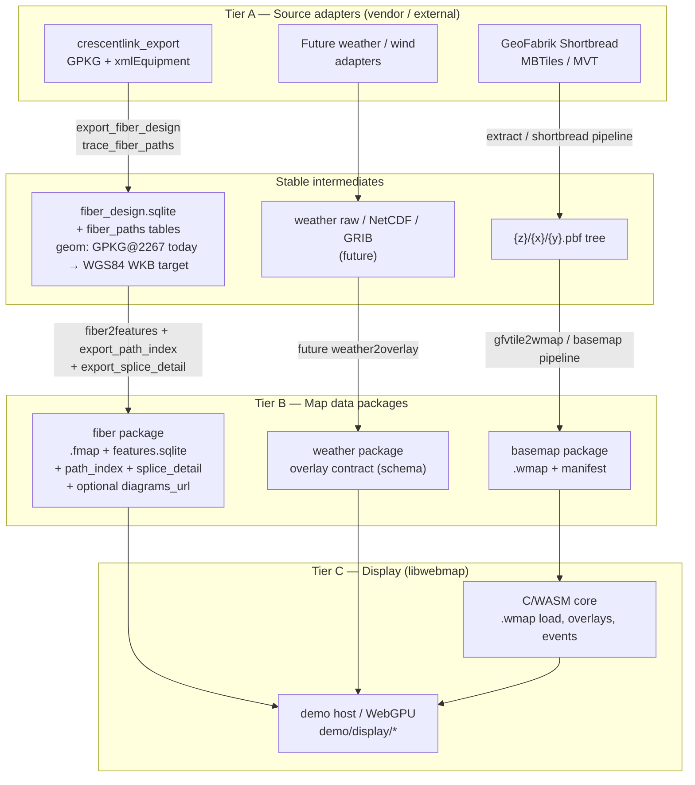
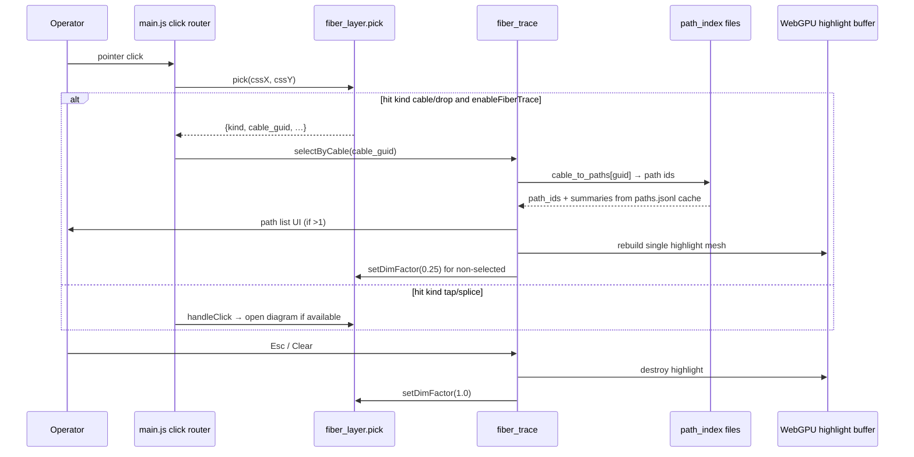

# Data Sources vs Display Separation + Fiber Path Tracing

| Field | Value |
|-------|-------|
| **Status** | Draft (revised after design review) |
| **Author** | (unassigned) |
| **Date** | 2026-07-17 |
| **Audience** | libwebmap / crescentlink_export maintainers |
| **Related ADRs** | 004, 007, 008, 011, 014, 015, 016; proposed 017, 018 |

---

## Overview

libwebmap today is a pure-C WebGPU map engine, but its **docs, demo commands, and data layout still treat `~/crescentlink_export` as an implicit second half of the product**. Fiber bake tools (`fiber2features`, `fiber2wmap`), path tracing (`trace_fiber_paths.py`), and vendor GeoPackage extraction all live outside libwebmap, while display formats (`.wmap`, `.fmap`, splice-detail JSON) and the WebGPU host live inside it. Operators regenerating demo data must know both trees and hard-coded home-directory paths.

This design establishes a **clear three-tier boundary**:

1. **Source adapters** — vendor-specific extractors (CrescentLink GPKG → normalized design DB; GeoFabrik MBTiles → MVT tree; future weather APIs).
2. **Map data packages** — stable, vendor-neutral on-disk layouts (`kind`, `source`, `format_version`) produced by bake pipelines.
3. **Display** — libwebmap C/WASM core + host (`demo/display/`) that consume packages only.

After that boundary is in place, **individual optical-fiber path highlighting** becomes a display feature driven by a precomputed path index exported beside `.fmap` data—reusing `fiber_paths` / `fiber_path_hops` rather than reimplementing graph walks in the browser or WASM core.

**Honest scope note:** Until Tier A emits **WGS84 WKB** geometry, Tier B (`fiber2features`) remains coupled to the **CrescentLink-normalized ECOEC design DB** (GPKG geom, EPSG:2267). Format ownership moves to libwebmap; full multi-vendor geom neutrality is a follow-on after CRS normalization in Tier A.

---

## Background & Motivation

### Current state

| Concern | Where it lives today | Coupling |
|---------|----------------------|----------|
| CrescentLink GPKG → `fiber_design.sqlite` | `crescentlink_export/export_fiber_design*` | Vendor XML/GPKG |
| Optical path walk | `crescentlink_export/trace_fiber_paths.py` | Needs full connectivity graph |
| Design → map features (`.fmap`) | `crescentlink_export/fiber2features.c` | Design DB + **EPSG:2267 GPKG geom** → display format |
| Splice HTML | `crescentlink_export/splice_diagram` | Design DB (~GB of HTML) |
| Compact magnifier JSON | `libwebmap/tools/export_splice_detail.py` | Design DB → demo package |
| Basemap Shortbread → `.wmap` | `libwebmap/tools/{extract_*,gfvtile2wmap,prepare_demo_tiles.sh}` | OSM/GeoFabrik only |
| Fiber paint / pick / magnifier | `libwebmap/demo/display/*` | Consumes `.fmap` + detail JSON; cable pick has **no plant GUID** |
| Format docs | `fiber2features.c` header; `fiber_fmap.js` says “Spec: crescentlink_export/…” | Spec not owned by libwebmap |

Demo regeneration (from `docs/guides/fiber-map-data.md`) hard-wires:

```bash
cd ~/crescentlink_export
./fiber2features fiber_design_test.sqlite -o ~/libwebmap/demo/fiber_data ...
python3 ~/libwebmap/tools/export_splice_detail.py ...
ln -sfn ~/crescentlink_export/splice_diagrams ~/libwebmap/demo/splice_diagrams
```

The fiber package manifest itself records absolute source paths:

```json
"source": "crescentlink fiber design",
"input": "/home/dwhite/crescentlink_export/fiber_design_test.sqlite"
```

### Pain points

1. **Ownership ambiguity.** `.fmap` is the map’s fiber feature format (ADR-015), yet its only formal layout is a comment in a CrescentLink-side C file. Display code (`fiber_fmap.js` line 3) comments “Spec: crescentlink_export/fiber2features.c”.
2. **No stable “data package” contract.** Basemap, fiber, and (future) weather each have ad-hoc manifests; no shared `kind` / `format_version` / source adapter fields.
3. **Missing identity for path join.** `map_cables.guid` exists in `features.sqlite` (39 803/39 803 non-null on demo), but **`.fmap` v2 cable/drop records omit cable GUID**. Host picks use synthetic `line_id` (`${tile}/${kind}/${idx}`), not plant identity. `load_cables()` SELECTs geom/size/strand and **never reads `c.guid` into the tile path**.
4. **Path tracing exists offline, not on the map.** Sample design DB has **21 361 paths**, **73 805 hops**, **~3.2 MB** total `geom_wkb` (max hop_count 13; max paths-per-cable ≈ 10). The WebGPU demo never loads them.
5. **False neutrality risk.** `fiber2features` hardcodes EPSG:2267 inverse projection and GPKG blob decoding; moving the tool without documenting CRS leaves Oklahoma/CrescentLink coupling inside libwebmap.
6. **Extensibility blocked by coupling.** Adding weather/wind “the CrescentLink way” would entangle another vendor adapter with the map engine.

### What already works (keep)

- ADR-015 data/display split: feature tables + `.fmap` vs `demo/display/` paint.
- Syscall-free C core; host feeds tiles/overlays (ADR-004, ADR-008, ADR-014).
- Offline basemap bake: Shortbread MBTiles → PBF → `gfvtile2wmap` → `.wmap`.
- Optical path walk in Python (correct place for graph algorithms and design-DB I/O).
- `export_splice_detail.py` already lives as a Tier B tool in libwebmap.

---

## Goals & Non-Goals

### Goals

1. **Name three tiers** (source adapter / data package / display) and place every existing tool in exactly one tier.
2. **Define package contracts** for basemap, fiber features (+ path index), and weather/wind (schema-only).
3. **Move map-facing bake tools** that consume *already-normalized* design data into libwebmap ownership, with an explicit build/SQLite plan and documented residual coupling.
4. **Decouple docs and demo** from `~/crescentlink_export` as a hard dependency for **paint and path trace**; vendor tree remains the CrescentLink *source adapter* only. Full click-through HTML diagrams remain optional inputs.
5. **Design fiber path visual trace v1** using precomputed path index + host WebGPU highlight; no graph walk in WASM.
6. **Leave room for weather/wind** via the same package/overlay extension points without implementing full ingest yet.
7. **Ship deterministic fixtures** so path-trace UI is reviewable and demoable without committing full plant DBs.

### Non-Goals

- Replacing CrescentLink XML parsing or GPKG access with something inside libwebmap.
- Implementing a second vendor fiber importer in v1.
- Full multi-vendor geometry neutrality in Tier B **before** Tier A emits WGS84 WKB (labeled as follow-on).
- Putting path graph walking inside `webmap.c` / WASM for v1.
- Full MapLibre style JSON.
- Real-time weather tile services or NWS/NOAA network code in the C core.
- Migrating historical `fiber2wmap` legacy bake as the primary demo path (it stays optional/legacy).
- Multi-tenant auth, CDN publishing, or production ops packaging (beyond local package layout).
- Shipping sql.js in the demo for v1.
- Committing multi-GB `splice_diagrams/` into libwebmap.

---

## Proposed Design

### 1. Boundary model (three tiers)



| Tier | Responsibility | I/O allowed | Examples |
|------|----------------|-------------|----------|
| **A — Source adapter** | Parse vendor dumps; normalize connectivity / raw geospatial; ideally CRS-normalize geom | Files, GDAL, libxml2, network optional | `export_fiber_design`, `trace_fiber_paths.py`, MBTiles extract |
| **B — Map package bake** | Produce display packages from **documented intermediate schema** | Files (host tools only) | `fiber2features`, `export_splice_detail.py`, `gfvtile2wmap`, `export_path_index.py` |
| **C — Display** | Hold map data, GPU descriptors, paint, interaction | Core: **no syscalls**; host: fetch + WebGPU | `libwebmap`, `demo/display/` |

**Hard rules:**

- Tier C never imports CrescentLink types, GPKG layer names, or `xmlEquipment` shapes.
- Tier B does **not** open GPKG dumps; it reads only the intermediate SQLite (or MVT/PBF for basemap).
- Tier B may still encode **CrescentLink-normalized conventions** until WGS84 input lands (documented in `fiber-design-input.md`, not claimed as multi-vendor-ready).

### 2. Where code lives after separation

#### 2.1 Recommended placement

| Artifact | Decision | Rationale |
|----------|----------|-----------|
| `export_fiber_design*` | **Stay in crescentlink_export** | Vendor GPKG + libxml2 + SDM XML |
| `trace_fiber_paths.py` | **Stay in crescentlink_export** | Connectivity graph walk; intermediate tables, not map tiles |
| `splice_diagram` | **Stay in crescentlink_export** | Large HTML product; optional package input via `diagrams_url` / `FIBER_DIAGRAMS_DIR` |
| `fiber2features` | **Move to libwebmap `tools/fiber2features/`** | Outputs `.fmap` + map tables — display formats owned by libwebmap (ADR-015) |
| `export_splice_detail.py` | **Already in libwebmap** — keep | Design DB → package-side JSON for host |
| Path-index export (new) | **libwebmap `tools/export_path_index.py`** | Map-facing index; joins to display |
| `.fmap` format spec | **libwebmap `docs/formats/fmap.md` + optional `include/webmap_fmap.h`** | Display format ownership |
| `schema_map.sql` | **Single source of truth under libwebmap `tools/schema/schema_map.sql`**; C writer must apply it (not drift from inlined DDL) | Map package schema |
| `fiber2wmap` | **Remain in crescentlink_export as legacy** | Not preferred demo path; duplicated CRS code accepted until retired |
| Shortbread → PBF → `.wmap` | **Promote to `tools/basemap_pipeline/`** | First-class basemap adapter + bake |
| `gfvtile2wmap` + MVT decoder | **Stay in libwebmap** | Already correct (ADR-011) |
| Weather ingest | **Future Tier A + B; not C core** | Schema contract first |

#### 2.2 Moving `fiber2features` — build, SQLite, residual coupling

**SQLite strategy (K12):** Host tool links **vendored SQLite amalgamation** under `tools/third_party/sqlite/` (copy of crescentlink’s `sqlite3.c`/`sqlite3.h` or a pinned amalgamation download). Reasons:

- Matches current crescentlink build (no system `libsqlite3-dev` required).
- Keeps WASM builds free of SQLite (tool target only when `WEBMAP_BUILD_TOOLS=ON` and not WASM).
- Avoids FetchContent network dependency in CI.

CMake sketch:

```cmake
if(WEBMAP_BUILD_TOOLS AND NOT WEBMAP_BUILD_WASM)
  add_executable(fiber2features
    tools/fiber2features/main.c   # or fiber2features.c
    tools/third_party/sqlite/sqlite3.c)
  target_include_directories(fiber2features PRIVATE tools/third_party/sqlite)
  target_link_libraries(fiber2features PRIVATE m)  # libm for projection
  # Do NOT link into webmap.wasm
endif()
```

**DDL single source:** On package open/create, `fiber2features` reads and executes `tools/schema/schema_map.sql` (path relative to source at build time via compile definition, or embed generated string from that file at configure time). Do **not** keep a second hand-edited `CREATE TABLE` block in C that can diverge from `schema_map.sql`.

**Residual CrescentLink-shaped assumptions** (document in `docs/formats/fiber-design-input.md`; **not multi-vendor-ready in v1**):

| Assumption | Today | Target |
|------------|-------|--------|
| `cables.geom` encoding | GeoPackageBinary header + WKB payload | Pure WGS84 WKB (or explicit `meta.geom_encoding`) |
| CRS of cable/SP geom | **EPSG:2267** US survey feet (hardcoded `ok_north_*` in C) | **WGS84** lon/lat; Tier B drops inverse projection |
| Drop detection | `ports.port_name_type = 'drop'` → temp `_drop_cables` | Same semantic column name in intermediate schema |
| Tap ports / colors | `equipment` + `equipment_disp` strand/tube | Same tables or documented aliases |
| Diagram basename | Matches `sd_diagram_filename()` rules | Keep as string attribute `diagram` on map rows; no live link to splice_diagram code |

**Label for v1 tool:** “Reads **CrescentLink-normalized fiber design SQLite (ECOEC conventions)**.” Multi-vendor readiness requires Tier A WGS84 normalization (see §3.2).

**Anti dual-source drift (PR4 + PR10):**

1. Move sources into libwebmap; build only there.
2. In crescentlink: replace `fiber2features` Makefile target with a **hard wrapper** that execs `$LIBWEBMAP_ROOT/build/fiber2features` (or `$(LIBWEBMAP)/build/fiber2features`) and **exits non-zero with a clear message** if missing—no silently stale local binary.
3. Do not leave a second full C copy in crescentlink after the move.

#### 2.3 Why not a separate `map_data` repo for v1

A third repository would cleanly isolate bake tools, but:

- Today there are two trees and one operator machine; a third increases coordination cost.
- Bake tools are small CLIs tightly coupled to format versions that libwebmap’s demo must match.
- libwebmap already hosts `export_splice_detail.py` and basemap tools.

**Decision:** Host map-facing bake under **libwebmap `tools/`**. Revisit a shared `map_data` package only if a second consumer needs the same binaries without the map engine.

#### 2.4 crescentlink_export role (after)

> **CrescentLink source adapter** — extracts SDM design from GeoPackage into `fiber_design.sqlite`, traces optical paths, and renders field splice diagrams. Map feature packages for libwebmap are produced by **libwebmap tools** that read the design DB (and optional diagram directory).

Optional later rename: `fiber_design_import` / `crescentlink_adapter` (not required for functional separation).

### 3. Source adapters (first-class)

#### 3.1 OSM / GeoFabrik Shortbread → basemap package

```
GeoFabrik Shortbread MBTiles
        │  tools/basemap_pipeline/extract_region.py
        ▼
  {z}/{x}/{y}.pbf  (+ REGION.txt)
        │  gfvtile2wmap --dir
        ▼
  demo/basemap/   (served package instance)
        {z}/{x}/{y}.wmap
        manifest.json
```

| Current | Proposed |
|---------|----------|
| `tools/extract_oklahoma_counties.py` | `tools/basemap_pipeline/extract_region.py` (region config: bbox/counties/z-range) |
| `tools/prepare_demo_tiles.sh` | `tools/basemap_pipeline/build_package.sh` |
| `tools/gfvtile2wmap/` | unchanged CLI; invoked by pipeline |

**Basemap manifest migration:** Keep existing keys the demo already uses (`bbox`, `center`, `zoom`, `zmin`, `zmax`, `tiles`, optional `counties`) and **add** package fields without breaking loaders:

| Field | Required? | Notes |
|-------|-----------|-------|
| `kind` | yes (new) | `"basemap"` |
| `format_version` | yes (new) | `1` = this manifest schema |
| `source.adapter` | yes (new) | e.g. `"geofabrik_shortbread"` |
| `source.label` | yes | human string (replace bare `"source": "..."` string over time) |
| `tiles`, `bbox`, `center`, `zoom`, `zmin`, `zmax` | yes | unchanged semantics |
| `counties` | optional | Oklahoma demo only |

`main.js` loader: accept both legacy top-level `"source": "string"` and structured `source.label` for one release.

#### 3.2 Fiber design → fiber package (intermediate contract + CRS)

```
CrescentLink GPKG  ──(Tier A)──►  fiber_design.sqlite
                                      │
                     trace_fiber_paths.py  (Tier A)
                                      │
                                      ▼
                         fiber_design.sqlite + fiber_paths*
                                      │
              ┌───────────────────────┼───────────────────────┐
              ▼                       ▼                       ▼
     fiber2features          export_path_index      export_splice_detail
       (Tier B)                 (Tier B)                (Tier B)
              │                       │                       │
              └───────────────────────┴───────────────────────┘
                                      ▼
                         fiber package (see §4.2)
```

##### Required tables / columns Tier B actually uses

Document as **“Fiber Design Intermediate Input v1”** in `docs/formats/fiber-design-input.md`.

| Table | Columns (minimum) | Used by |
|-------|-------------------|---------|
| `cables` | `guid`, `cable_size`, `geom` | fiber2features |
| `splicepoints` | `guid`, `station_id`, `geom` | fiber2features, diagrams |
| `equipment` | `guid`, `splicepoint_guid`, `is_tap`, `tap_ports`, `tap_loss_db` | fiber2features, splice_detail |
| `equipment_disp` | `guid`, `name`, `fiber_tube_color`, `fiber_strand_color`, `geom` (optional) | taps colors/names |
| `ports` | `parent_guid`, `port_name_type`, `patch_guid`, `patch_number`, `split_db`, … | drop detect, splice_detail |
| `connections` | from/to guid+number | splice_detail |
| `meta` | `key`, `value` | recommended for CRS/encoding |
| `fiber_paths` | see `schema_paths.sql` | export_path_index |
| `fiber_path_hops` | see `schema_paths.sql`; index on `(cable_guid, fiber_number)` | export_path_index |

##### Geometry encoding and CRS (critical)

**Today (ECOEC / CrescentLink exporter):**

| Property | Value |
|----------|-------|
| Encoding | GeoPackageBinary (“GP” header + flags + envelope + ISO WKB) **or** raw WKB (Python exporter path) |
| CRS | **EPSG:2267** (NAD83 Oklahoma North, US survey feet) |
| Tier B behavior | `fiber2features` embeds inverse projection `ok_north_*` → WGS84 lon/lat for tiling |

**Long-term contract (preferred):**

| Property | Value |
|----------|-------|
| Encoding | **Plain ISO WKB** (endian byte + type + coords), no GPKG envelope required |
| CRS | **EPSG:4326** (WGS84 lon/lat degrees) for all `cables.geom` / SP geom / `fiber_paths.geom_wkb` |
| `meta` keys | `geom_crs=EPSG:4326`, `geom_encoding=wkb` |
| Tier B | No projection module; only Web Mercator tile math from lon/lat |

**Transition policy:**

1. **v1 (this design):** Document current ECOEC behavior as the **only supported producer**. `fiber2features` keeps EPSG:2267 path; manifest `source.adapter` = `"crescentlink_normalized_ecoec"`.
2. **v1.1:** Tier A (`export_fiber_design` or a small `normalize_design_geom.py`) rewrites geom to WGS84 WKB and sets `meta`.
3. **v1.2:** Tier B accepts `meta.geom_crs`; if `EPSG:4326` + `wkb`, skip `ok_north_*`; if missing meta, default to legacy 2267/GPKG for one release then hard-fail.

Until step 3, **do not claim** “any vendor implementing the tables works.” Claim: “any tool that emits this intermediate **including geom CRS/encoding contract** works.”

##### Path geom for path_index

`export_path_index` must project path geometry to WGS84 lon/lat polylines:

- Prefer decoding `fiber_paths.geom_wkb` the same way `trace_fiber_paths.py` produced it (today: design CRS / GPKG-aware).
- Emit package polylines always as **WGS84** `lonlat: [[lon,lat],…]`.
- MultiLineString → concatenate parts with optional NaN break or densified single ring; v1 flattens to one coordinate array (document seam policy: concatenate without false segments longer than threshold, or insert break markers the host skips when drawing).

#### 3.3 Weather / wind (future — schema only)

Do **not** implement ingest in implementation PRs beyond a fixture + optional stub loader.

**Host mapping table** (`docs/formats/weather-package.md`):

| Package feature | `webmap_overlay_desc_t` | Class | Notes |
|-----------------|-------------------------|-------|-------|
| GeoJSON `Polygon` / `MultiPolygon` | FILL | `WEBMAP_CLASS_ALERT` | Ice/flood polygons; status from `props.severity` → `webmap_status_t` |
| GeoJSON `LineString` | LINE | `WEBMAP_CLASS_ALERT` | Corridor alerts |
| GeoJSON `Point` | POINT | `WEBMAP_CLASS_ALERT` | Station alerts |
| Gridded wind | **not** via overlay API in v1 | — | Package may include `"raster": { "url": "…", "crs": "EPSG:3857", "bounds": […] }` for **host-only** canvas/WebGPU texture; C core unchanged |
| Wind barbs | deferred | — | Symbol layer in host later |

```json
{
  "kind": "weather",
  "format_version": 1,
  "source": { "adapter": "nws_forecast", "retrieved_at": "…" },
  "features": [
    {
      "id": "ice-zone-1",
      "class": "alert",
      "status": "degraded",
      "geom": { "type": "Polygon", "coordinates": [/* … */] },
      "props": { "hazard": "ice", "valid_until": "…" }
    }
  ]
}
```

Status string → enum: `unknown|ok|degraded|down|maint` → `WEBMAP_STATUS_*`. Colors via `webmap_status_rgba`.

### 4. Display layer contract

#### 4.1 What libwebmap + demo consume

| Input | Consumer | Required for paint? | Required for path trace? | Required for full HTML diagram click? |
|-------|----------|---------------------|--------------------------|---------------------------------------|
| `.wmap` + basemap manifest | C core + host | Yes | No | No |
| `.fmap` + fiber manifest | `fiber_fmap.js` / `fiber_layer.js` | Yes | fmap **v3** + guids | No |
| `features.sqlite` | Offline tools | No (browser) | No | No |
| `splice_detail/` | magnifier | No (fmap fallback) | No | No |
| `path_index/` | `fiber_trace.js` | No | **Yes** | No |
| `diagram_index.json` | basename lookup | No | No | Helpful |
| `splice_diagrams/` HTML | `window.open` | No | No | **Yes** |
| Dynamic overlays | `webmap_upsert_overlay` | Optional | No | No |

**Package policy for diagrams (K14):**

- `diagrams_url` is **optional**. If missing or 404, click on tap/splice is a no-op (or toast “diagrams not installed”); magnifier + path trace still work.
- Demo **must** run with only: basemap package + fiber package (fmap + optional path_index + optional splice_detail)—**no second git tree required**.
- Operator installs diagrams separately: `FIBER_DIAGRAMS_DIR=/path/to/html` or copy/symlink into `demo/splice_diagrams` / URL in manifest.
- `diagram_index.json` and `diagram` basenames remain produced by `fiber2features` (stable string contract); HTML files remain Tier A artifacts.

**Zero hard dependency** on CrescentLink GPKG paths, `xmlEquipment`, or absolute home-directory paths in manifests. Bake tools **must not write absolute `input` paths by default**; use `source.label` + optional `source.input_fingerprint` (sha256 of design DB).

#### 4.2 Data package layout

Served instances stay under `demo/` (Open Question 1 resolved as recommendation):

```
demo/
  basemap/                     # kind=basemap
    manifest.json
    {z}/{x}/{y}.wmap
  fiber_data/                  # kind=fiber
    manifest.json
    features.sqlite
    diagram_index.json
    path_index/
      meta.json
      cable_to_paths.json      # browser default
      paths.jsonl              # browser default
    path_index.sqlite          # offline optional
    {z}/{x}/{y}.fmap
    splice_detail/<guid>.json
  splice_diagrams/             # OPTIONAL external; often gitignored symlink
```

Abstract layout for docs: `docs/formats/data-packages.md` describes the same shape under any root.

##### Versioning (manifest vs tile vs index)

| Field | Versions | Bump when |
|-------|----------|-----------|
| `format_version` | Package **manifest schema** | New/removed/renamed top-level manifest keys or semantics |
| `fmap_version` | `.fmap` **tile bytes** | Line/point record layout (v2 → v3 guids) |
| `path_index_format` | Path index files | JSONL/sqlite field changes |
| `splice_detail` schema `v` | Per-file JSON | ADR-016 detail shape |

Host checks: if `fmap_version < 3` or `path_index` missing → paint works; trace disabled with log message.

##### Common manifest fields

```json
{
  "kind": "basemap",
  "format_version": 1,
  "name": "oklahoma_counties",
  "source": {
    "adapter": "geofabrik_shortbread",
    "label": "GeoFabrik oklahoma-shortbread-1.0",
    "input_fingerprint": "sha256:…"
  },
  "crs_display": "EPSG:3857",
  "bbox": [-97.15, 34.95, -95.05, 36.35],
  "center": [-95.99, 36.15],
  "zoom": 10,
  "zmin": 8,
  "zmax": 12,
  "created_at": "2026-07-17T00:00:00Z",
  "tiles": [{ "z": 10, "x": 238, "y": 401 }]
}
```

##### Fiber-specific additions

```json
{
  "kind": "fiber",
  "format_version": 1,
  "format": "fmap",
  "fmap_version": 3,
  "name": "ecoec_sample",
  "source": {
    "adapter": "crescentlink_normalized_ecoec",
    "label": "fiber_design_test",
    "input_fingerprint": "sha256:…"
  },
  "tables": ["map_cables", "map_taps", "map_splices"],
  "features_sqlite": "features.sqlite",
  "path_index": "path_index/",
  "path_index_format": 1,
  "path_index_files": {
    "meta": "path_index/meta.json",
    "cable_to_paths": "path_index/cable_to_paths.json",
    "paths": "path_index/paths.jsonl"
  },
  "splice_detail_url": "./splice_detail/",
  "diagrams_url": null,
  "diagram_index": "diagram_index.json",
  "features": {
    "cables": 39803,
    "drops": 16807,
    "taps": 10533,
    "splices": 24298,
    "paths": 21361
  }
}
```

When diagrams are installed locally, set `"diagrams_url": "./splice_diagrams/"` (relative to demo root, not fiber_data, if that matches current click resolver—document actual resolution in `fiber_style.js` / `diagramUrl`).

### 5. Directory & documentation cleanup

| Doc / entry | Change |
|-------------|--------|
| `AGENTS.md` | Split basemap package / fiber package / run demo. `FIBER_DESIGN_DB`, optional `FIBER_DIAGRAMS_DIR`. No required `~/crescentlink_export` layout. |
| `ARCHITECTURE.md` | Three-tier diagram; tools list; CRS honesty note. |
| `docs/guides/fiber-map-data.md` | Tier A/B/C; path index; diagram optional; single primary rewrite after ADR (avoid thrash—see PR plan). |
| `docs/guides/oklahoma-tiles.md` | Basemap adapter example + new manifest fields. |
| `docs/DOMAIN.md` | Multi-source overlays. |
| `docs/formats/fmap.md` | Normative v2 + v3. |
| `docs/formats/data-packages.md` | Manifest + versioning. |
| `docs/formats/fiber-design-input.md` | Tables, CRS, encoding, residual conventions. |
| `docs/formats/path-index.md` | Browser default files + sizes. |
| `docs/formats/weather-package.md` | Mapping table + fixture. |
| ADR-017 / ADR-018 | Boundary; path trace. |
| crescentlink README | Adapter-only; hard wrapper to libwebmap fiber2features. |
| `demo/` | Relative URLs; gitignore large regenerables; optional diagrams. |

### 6. Individual fiber visual trace (post-separation)

#### 6.1 User-facing behavior (v1) — interaction contract

**Gesture precedence** (sticky path mode until clear):

| Gesture | Result |
|---------|--------|
| **Click cable/drop** | Enter/update path trace: lookup `cable_guid` in `cable_to_paths`; show path list (grouped by fiber if multiple); if exactly one path, auto-select and highlight |
| **Click tap/splice** with `sp_guid` | **Unchanged:** open splice diagram when `diagrams_url` resolves; **does not** start path trace |
| **Alt-click** (or UI button) **tap/splice** | Optional v1.1: list paths whose hops include that `sp_guid` |
| **Click empty map** | No change (do not clear—avoids misclick loss) |
| **Esc** or **Clear path** control | Clear selection, hide path list, destroy highlight buffer, restore full cable opacity |
| **Hover / magnifier** | Unchanged dwell behavior; does not select paths in v1 |

When path_index is missing: click cable logs/toasts “Path index not available for this package” and does not steal tap/splice diagram behavior.



#### 6.2 Data needed (export once, not walk in browser)

| Field | Source | Use |
|-------|--------|-----|
| `path_id` | `fiber_paths` | Selection key |
| start/end cable+fiber, `end_kind`, `hop_count`, `total_loss_db`, `has_drop` | `fiber_paths` | Path list UI |
| WGS84 `lonlat[]` | from `geom_wkb` | Highlight polyline |
| hops | `fiber_path_hops` | Hop panel; SP filter later |
| cable membership | `fiber_path_hops` where `hop_kind='cable'` | **Join key for pick** |

**Map join key:** cable GUID on fmap v3 spans.

#### 6.3 `.fmap` v3 — concrete implementation checklist

Binary layout for cable/drop records:

```
n_pts u16, size u16, rgba u32, cable_guid[16], pts[n_pts]{float x,y}
```

Header: version field = **3**. Taps/splices unchanged (already have `sp_guid[16]`).

**Writer (fiber2features) — not a one-line fwrite:**

1. Extend `line_feat_t` (or equivalent) with `uint8_t cable_guid[16]` (zero if missing).
2. Change `load_cables()` SQL from `SELECT c.geom, …` to **`SELECT c.guid, c.geom, …`**; `parse_uuid_bytes` into feature.
3. Same for drop path if separate.
4. `emit` / encode path: write 16 bytes after rgba, before pts.
5. Update `fmap_size_of` / tile size accounting: **+16 bytes per cable/drop line**.
6. `features.sqlite` `map_cables.guid` already written—keep consistent with tile guids.
7. Manifest `fmap_version: 3`.

**Parser / host:**

1. `fiber_fmap.js`: dual-version parse; v2 lines omit guid (empty string); v3 reads 16 bytes → `cable_guid` string via existing `guidBytesToString`.
2. `fiber_layer.js` `storeLineHits` / line hit records: store `cable_guid` (not only synthetic `line_id`).
3. `pick()` return value includes `cable_guid` for cable/drop hits.
4. `main.js` routes cable hits to `fiber_trace` when enabled.

**Fixtures / tests:**

- `fixtures/fiber_path_trace/sample_v2.fmap` — golden v2 (no guids).
- `fixtures/fiber_path_trace/sample_v3.fmap` — few cables with known guids.
- JS parse smoke (node or browser-less) **or** small C test if encode helper is shared.
- Do not require full plant regen inside the format PR if fixtures cover parse/encode; **demo data regen is a separate PR** (PR6b).

**Migration:** v2 still paints; path trace requires v3 + path_index.

#### 6.4 Path index format — browser default (ECOEC-grounded)

##### Measured sample (`fiber_design_test.sqlite`)

| Metric | Value |
|--------|-------|
| Paths | **21 361** |
| Hops | **73 805** |
| Σ `geom_wkb` | **~3.25 MB** |
| Max hop_count | **13** |
| Max paths per cable | **~10** |
| Distinct cables in cable hops | **~28 262** |
| Est. browser JSON (paths.jsonl + map) | **~12–20 MB** uncompressed |

Full-plant territories may grow toward 10⁵ paths; **do not** default to one file per path (21k inodes is a bad static-server default).

##### Dual emit (required)

| Artifact | Audience | Format |
|----------|----------|--------|
| `path_index.sqlite` | Offline tools / optional future sql.js | Tables mirroring path summary + hops + optional lonlat blob |
| `path_index/meta.json` + `cable_to_paths.json` + `paths.jsonl` | **Browser default (v1)** | See below |

##### Browser default layout (`path_index_format: 1`)

```
path_index/
  meta.json
  cable_to_paths.json    # { "<uuid>": [path_id, …], … }
  paths.jsonl            # one JSON object per line, keyed by path_id
```

**`meta.json`:**

```json
{
  "path_index_format": 1,
  "path_count": 21361,
  "hop_count": 73805,
  "crs": "EPSG:4326",
  "max_hop_count": 13,
  "generated_at": "…"
}
```

**`cable_to_paths.json`:** map full lowercased UUID string → array of path_id integers. Built from:

```sql
SELECT DISTINCT cable_guid, path_id
FROM fiber_path_hops
WHERE hop_kind = 'cable' AND cable_guid IS NOT NULL AND cable_guid != '';
```

(Uses existing `fiber_path_hops_cable_idx`.)

**Do not** shard by 8-hex prefix for v1 demo (unnecessary at ~28k keys; collision policy deferred). If a future multi-territory package exceeds ~50 MB JSON or ~200k cables, allow optional directory shards with **full guid filenames** (not 8-char prefixes) under `by_cable/`.

**`paths.jsonl` line object:**

```json
{
  "path_id": 42,
  "start": { "cable_guid": "…", "fiber": 6 },
  "end": { "cable_guid": "…", "fiber": 6 },
  "end_kind": "drop",
  "hop_count": 12,
  "total_loss_db": -21.4,
  "has_drop": 1,
  "lonlat": [[-95.99, 36.12], [-95.98, 36.11]],
  "hops": [
    { "seq": 0, "kind": "cable", "cable_guid": "…", "fiber": 6 },
    {
      "seq": 1,
      "kind": "equipment",
      "sp_guid": "…",
      "station_id": "79-11-38",
      "port_name": "Pass Through",
      "split_db": -0.2
    }
  ]
}
```

Host load strategy: fetch `meta.json` + `cable_to_paths.json` at fiber package init; **lazy-scan or index `paths.jsonl`** — for ECOEC ~20 MB, acceptable to fetch and build `Map<path_id, obj>` once on first cable click (cache in memory). Optional gzip on CDN (`paths.jsonl.gz`) with `Content-Encoding` — static python server may not gunzip; prefer uncompressed for local demo.

**Thresholds for format escalation:**

| Condition | Transport |
|-----------|-----------|
| Path geom + JSON ≲ **50 MB**, path_count ≲ **100k** | **Default:** `cable_to_paths.json` + `paths.jsonl` |
| Larger | Segment-sharing (path stores cable_guid sequence only) or sqlite/sql.js — future ADR |

**v1 default geometry:** pre-merged path polyline in each JSONL record (from `fiber_paths.geom_wkb`), not segment refs.

#### 6.5 Performance & rendering (implementable minimum)

| Concern | v1 minimum |
|---------|------------|
| Highlight | **One** host WebGPU line buffer rebuilt on selection (extrude path `lonlat` → mercator mesh like cables). **Default: host-drawn** in `fiber_trace.js` / fiber line pipeline—not `webmap_upsert_overlay` (K13). |
| Dim others | Add a **global uniform** `u_fiber_dim` (default 1.0) to the existing cable line WGSL fragment/vertex color multiply; on selection set dim to **0.25** for the main cable pipeline and draw highlight at full opacity in a second pass. **Do not** rewrite all cable vertices. If adding a uniform is blocked in the first UI PR, acceptable interim: multiply rgba when **rebuilding** visible tile meshes only while selection active (costlier; document as interim). |
| Caps | 1 highlighted path; **≤32** candidates in list (sample max ~10); **≤50 000** highlight polyline vertices; **≤256** hops retained per path in UI |
| Tile vs whole-path | Whole-path overlay in mercator meters; independent of fmap zoom |
| Sample worst-case | Max `geom_wkb` ~1.2 KB → on the order of tens of vertices per path; far below 50k cap |

#### 6.6 Style

- `TRACE_HIGHLIGHT_RGBA` in `fiber_style.js` (high-contrast amber/cyan).
- `FIBER_DIM_FACTOR = 0.25`.
- Path list: small HTML panel in `demo/index.html` (host UI).

---

## API / Interface Changes

### C core (libwebmap)

**v1 path trace: no C API changes.** Highlight is host WGSL (K13).  
Optional later: `webmap_upsert_overlay` with a dedicated class—non-blocking.

### Host display modules

| Module | Change |
|--------|--------|
| `fiber_fmap.js` | v2/v3 dual parse; `cable_guid` on lines |
| `fiber_layer.js` | Hits carry `cable_guid`; `setDimFactor(f)`; expose pick kinds cleanly |
| `fiber_trace.js` **(new)** | Load path_index; candidates; highlight mesh; Esc/clear |
| `fiber_style.js` | Highlight + dim constants |
| `main.js` | Click router per §6.1 |
| `index.html` | Path list + Clear control |

### Bake tool CLI

```bash
export FIBER_DESIGN_DB=/path/to/fiber_design.sqlite   # any location
export FIBER_DIAGRAMS_DIR=/path/to/splice_diagrams    # optional

./tools/build_fiber_package.sh \
  --design "$FIBER_DESIGN_DB" \
  --out demo/fiber_data \
  --zmin 10 --zmax 14

# Internally:
#   ./build/fiber2features … --fmap-version 3
#   python3 tools/export_splice_detail.py …
#   python3 tools/export_path_index.py …   # fails if no fiber_paths
# never writes absolute machine paths into manifest by default
```

---

## Data Model Changes

### `features.sqlite` / `schema_map.sql`

Keep `map_cables`, `map_taps`, `map_splices` as today (`map_cables.guid` already present).

**No `map_path_refs` table in v1.** Offline tools query `path_index.sqlite` or the design DB’s `fiber_path_hops` directly. Revisit only if a package-local offline CLI needs a denormalized join without the design DB.

### Path index — see §6.4

### Migration strategy

1. fmap v3 writer + dual parser + fixtures.
2. **Regenerate** demo fiber package (or commit minimal `fixtures/fiber_path_trace/` for CI + optional full demo regen).
3. Trace requires `fmap_version >= 3` and `path_index/`.
4. No runtime migration of old packages.

---

## Alternatives Considered

### A1. Move only docs; leave all tools in crescentlink_export

| Pros | Cons |
|------|------|
| Zero code move | Format ownership stays wrong |

**Rejected.**

### A2. New standalone `map_data` repository

| Pros | Cons |
|------|------|
| Clean boundary | Third repo; overkill for two-tree setup |

**Deferred.**

### A3. Graph walk in browser / WASM from splice_detail

| Pros | Cons |
|------|------|
| No path_index | Local SP only; wrong layer |

**Rejected.**

### A4. Bake full path geometry into `.fmap` layers

| Pros | Cons |
|------|------|
| Single fetch | Tile bloat; poor selection model |

**Rejected.**

### A5. Cable GUID only in `features.sqlite` / spatial join

| Pros | Cons |
|------|------|
| No fmap bump | Needs heavy browser DB |

**Rejected** in favor of fmap v3.

### A6. Weather baked into C core tile cache

**Rejected** (ADR-014; dynamic data).

### A7. Reuse `fiber2wmap --layers …,paths` as interim path visualization

`fiber2wmap` already can bake a static paths layer from `fiber_paths.geom_wkb`.

| Pros | Cons |
|------|------|
| Low effort; geometry already offline | **No per-fiber selection / pick join**; paints all paths or none; regresses ADR-015 data/display split (GPU-baked policy in export tool); does not satisfy “trace an individual fiber” |

**Rejected** as the product path-trace design. May remain a debugging aid inside crescentlink only.

---

## Security & Privacy Considerations

| Threat | Severity | Mitigation |
|--------|----------|------------|
| Untrusted tiles / path JSON | Medium | Parser bounds; **caps: 50k verts, 256 hops, 32 candidates** before GPU upload |
| Plant topology in design DB / path_index | High (ops) | Local/private packages; gitignore regenerables; treat path_index like design DB |
| Absolute paths leaking machine layout | Low | Bake tools default to label + fingerprint only |
| Diagram HTML XSS | Low | Static export; `noopener` on `window.open` |
| Demo static server | N/A | Local; production host owns auth |

Core remains syscall-free.

---

## Observability

| Signal | Where | Notes |
|--------|-------|-------|
| Package load / version mismatch | Host log | `fmap_version`, `path_index_format` |
| Path index miss | Counter | Cable click with empty map entry |
| Highlight vertex count | Debug | Warn if > 50k (should not happen on sample) |
| Bake exit codes | CI | Fail if `fiber_paths` missing when path_index requested |
| **DoD tests** | ctest / node | fmap v2/v3 fixture parse; `export_path_index` dry-run on synthetic SQLite fixture |

---

## Rollout Plan

### Phase 0 — Documentation

- ADR-017; formats docs; CRS honesty; package versioning.

### Phase 1 — Own formats + move bake tools

- fiber2features + schema_map + SQLite amalgamation + hard crescentlink wrapper.
- Basemap pipeline promotion.

### Phase 2 — Package layout + demo decoupling

- Manifests; `FIBER_DESIGN_DB` / `FIBER_DIAGRAMS_DIR`; diagrams optional.

### Phase 3 — fmap v3 + path_index + fixtures + UI

- Writer/parser checklist; path_index default JSON; **fixture + demo regen**; fiber_trace UI; ADR-018.

### Phase 4 — Weather contract

- Schema + fixture; optional stub loader.

### Feature flags

- `enableFiberTrace` default true iff `manifest.path_index` present and `fmap_version >= 3`.

### Rollback

- v2 paints; trace off without index; crescentlink hard wrapper only (no second C tree).

### Risks

| Risk | Severity | Mitigation |
|------|----------|------------|
| Dual maintenance during move | Medium | Hard wrapper; delete C copy from crescentlink |
| Claiming multi-vendor too early | Medium | Label ECOEC conventions; WGS84 roadmap |
| Path index size at full plant | Medium | 50 MB threshold; segment-sharing later |
| PR thrash on fiber-map-data.md | Low | One substantive rewrite in PR5; PR2 only format stubs |
| PR8 untestable without data | High | PR6b fixtures + optional demo regen before PR8 |

---

## Open Questions

1. **Package root:** `demo/` as served instance vs top-level `packages/`? → **Resolved recommendation:** `demo/` instances; abstract layout in docs only.
2. **Browser path_index transport?** → **Resolved as K11:** `cable_to_paths.json` + `paths.jsonl` for v1 (ECOEC-sized).
3. **Move `trace_fiber_paths.py` into libwebmap?** → **No** (Tier A).
4. **Rename crescentlink_export now?** → **After** tool move.
5. **Fiber number on click?** → List all matching paths grouped by fiber (cap 32).
6. **Weather raster sketch in demo?** → Contract only for PR9; optional stub polygons only.
7. **When to implement Tier A WGS84 geom rewrite?** → Follow-on after path-trace demo; not blocking format ownership move.

---

## Key Decisions

| # | Decision | Rationale |
|---|----------|-----------|
| K1 | **Three tiers: source adapter → map package → display** | Ownership testable; matches ADR-014/015 |
| K2 | **libwebmap owns display formats** (`.wmap`, `.fmap`, splice_detail, path_index, manifests) | Specs live with consumers |
| K3 | **crescentlink_export stays vendor extractor + path tracer + HTML diagrams** | GPKG/XML/graph not map-engine |
| K4 | **`fiber2features` moves into libwebmap `tools/`** with CMake + **vendored SQLite amalgamation**; residual ECOEC/CRS coupling **documented**, not claimed multi-vendor | Format ownership without pretending geom neutrality |
| K5 | **No new `map_data` repo for v1** | Two trees enough |
| K6 | **Promote Shortbread scripts to `tools/basemap_pipeline/`** | Named basemap adapter |
| K7 | **Path trace v1 = precomputed index + host highlight; no WASM graph walk** | Reuse `fiber_paths` |
| K8 | **`.fmap` v3 adds cable GUID** on spans; full writer/parser/pick checklist | Join key for path_index |
| K9 | **Weather/wind are overlay packages later; not core layers** | ADR-014; mapping table in format doc |
| K10 | **Demo uses `FIBER_DESIGN_DB` + optional `FIBER_DIAGRAMS_DIR`; bake tools never write absolute paths by default** | Decouple from `~/crescentlink_export` layout |
| K11 | **Browser path_index default = `cable_to_paths.json` + `paths.jsonl`** (+ optional `path_index.sqlite` offline). Not 21k micro-files. ECOEC ~12–20 MB / 21k paths | Avoid inode storm; fits static demo |
| K12 | **Host tools use vendored SQLite amalgamation under `tools/third_party/sqlite/`; not linked into WASM** | Portable CI; matches prior Makefile |
| K13 | **v1 path highlight is host-drawn WebGPU (fiber line path), not `webmap_upsert_overlay`** | No C API change; matches existing fiber meshes |
| K14 | **`diagrams_url` / splice HTML are optional package inputs; demo paint + path trace work without crescentlink tree** | True decoupling for core UX |
| K15 | **Long-term design-DB geom = WGS84 WKB; v1 Tier B still supports ECOEC GPKG@EPSG:2267 with explicit labeling** | Honest intermediate contract |
| K16 | **No `map_path_refs` in features.sqlite for v1** | Avoid unused schema surface |
| K17 | **Package `format_version` versions manifest; `fmap_version` tiles; `path_index_format` index files** | Independent evolution |
| K18 | **Caps: 32 candidates, 50k highlight verts, 256 hops/UI, dim factor 0.25 via uniform preferred** | Bounded hot path |

---

## References

| Path | Relevance |
|------|-----------|
| `/home/dwhite/libwebmap/AGENTS.md` | Product constraints, demo coupling |
| `/home/dwhite/libwebmap/ARCHITECTURE.md` | Module map |
| `/home/dwhite/libwebmap/docs/decisions/014-plumbing-vs-host-renderer.md` | Host vs core |
| `/home/dwhite/libwebmap/docs/decisions/015-fiber-data-display-split.md` | `.fmap` vs display |
| `/home/dwhite/libwebmap/docs/decisions/016-fiber-hover-magnifier.md` | splice_detail |
| `/home/dwhite/libwebmap/docs/guides/fiber-map-data.md` | Current fiber pipeline |
| `/home/dwhite/libwebmap/demo/display/fiber_layer.js` | Pick / click / line hits |
| `/home/dwhite/libwebmap/demo/display/fiber_fmap.js` | fmap parse |
| `/home/dwhite/libwebmap/CMakeLists.txt` | Tools without SQLite today |
| `/home/dwhite/crescentlink_export/fiber2features.c` | fmap v2; EPSG:2267; no cable guid on lines |
| `/home/dwhite/crescentlink_export/schema_map.sql` | Map tables (DDL currently inlined in C too) |
| `/home/dwhite/crescentlink_export/schema_paths.sql` | fiber_paths / hops |
| `/home/dwhite/crescentlink_export/trace_fiber_paths.py` | Optical path walk |
| `/home/dwhite/crescentlink_export/fiber_design_test.sqlite` | 21361 paths, 73805 hops (scale reference) |

---

## PR Plan

Incremental, independently reviewable PRs. Dependency-respecting; **data fixtures before UI**.

### PR1 — ADR-017: three-tier boundary

| | |
|--|--|
| **Title** | docs: ADR-017 three-tier data boundary (sources / packages / display) |
| **Affects** | `docs/decisions/017-…md`, `ARCHITECTURE.md`, `docs/README.md` |
| **Depends on** | — |
| **Description** | Record K1–K7, K9–K10, K14–K15. Vocabulary only. |

### PR2 — Format ownership docs (before any code move)

| | |
|--|--|
| **Title** | docs: data packages, fmap v2 normative text, fiber-design-input CRS |
| **Affects** | `docs/formats/{data-packages,fmap,fiber-design-input}.md`, point `fiber_fmap.js` comment at libwebmap docs; **minimal** note in fiber-map-data (full rewrite deferred to PR5) |
| **Depends on** | PR1 |
| **Description** | Spec home for `.fmap`; intermediate CRS/encoding honesty; versioning paragraph (K17). |

### PR3 — Basemap pipeline promotion

| | |
|--|--|
| **Title** | tools: basemap_pipeline + package manifest fields |
| **Affects** | `tools/basemap_pipeline/*`, oklahoma guide, AGENTS basemap commands, `main.js` tolerant source.label |
| **Depends on** | PR1 |
| **Description** | Named pipeline; add `kind`/`format_version`/`source.adapter` while keeping legacy keys. |

### PR4a — fiber2features move (CMake + SQLite + schema_map)

| | |
|--|--|
| **Title** | tools: fiber2features host tool with vendored SQLite |
| **Affects** | `tools/fiber2features/`, `tools/third_party/sqlite/`, `tools/schema/schema_map.sql`, `CMakeLists.txt` |
| **Depends on** | PR2 |
| **Description** | Move C sources; amalgamation; execute schema_map.sql for DDL; build only as host tool. No fmap v3 yet. |

### PR4b — crescentlink hard wrapper + README adapter role (partial)

| | |
|--|--|
| **Title** | crescentlink_export: hard-wrap fiber2features to libwebmap binary |
| **Affects** | crescentlink `Makefile`, `README.md` (adapter wording), remove/stop building local fiber2features.o |
| **Depends on** | PR4a |
| **Description** | Wrapper fails loudly if libwebmap binary missing. Prevents dual-source drift. |

### PR5 — Decouple demo docs; build_fiber_package.sh; diagrams optional

| | |
|--|--|
| **Title** | docs/demo: FIBER_DESIGN_DB, FIBER_DIAGRAMS_DIR, relative manifests |
| **Affects** | AGENTS, fiber-map-data **full** rewrite, README, `tools/build_fiber_package.sh`, export_splice_detail path examples |
| **Depends on** | PR4a |
| **Description** | Single recipe; no absolute input paths; diagrams optional for demo run. |

### PR6 — fmap v3 GUID checklist

| | |
|--|--|
| **Title** | fmap v3: cable GUID writer + dual parser + pick plumbing |
| **Affects** | fiber2features (`line_feat_t`, SELECT guid, size math), `docs/formats/fmap.md`, `fiber_fmap.js`, `fiber_layer.js`, **fixtures v2/v3** + parse smoke |
| **Depends on** | PR4a |
| **Description** | Full §6.3 checklist. Fixtures in-repo; full demo tile regen is PR6b. |

### PR6b — Demo / fixture data regeneration

| | |
|--|--|
| **Title** | data: regenerate demo fiber_data fmap v3 + minimal path-trace fixture package |
| **Affects** | `demo/fiber_data/` (or documented regen script output), `fixtures/fiber_path_trace/` (tiny design sqlite + few fmap tiles + path_index), gitignore rules |
| **Depends on** | PR6, PR7 (or regenerate path_index after PR7 lands—order: PR6 → PR7 → PR6b if path_index required in same package) |
| **Description** | **Unblocks PR8 demo.** Prefer: (1) always-commit small fixture package for CI; (2) script to regen full demo from `FIBER_DESIGN_DB` without committing multi-GB diagrams. |

*Ordering note:* PR6b depends on PR7 for path_index files in the fixture; if PR7 is ready first, generate both together.

### PR7 — export_path_index (browser default format)

| | |
|--|--|
| **Title** | tools: export_path_index → cable_to_paths.json + paths.jsonl |
| **Affects** | `tools/export_path_index.py`, `docs/formats/path-index.md`, build_fiber_package.sh, unit test on **synthetic** sqlite with a few `fiber_paths` rows |
| **Depends on** | PR5 (package layout); **precondition:** design DB has `fiber_paths` (document; CI uses synthetic fixture, not full plant) |
| **Description** | Fail-closed if paths missing. Dual emit sqlite optional. ECOEC sizes documented. |

### PR8 — ADR-018 + path trace UI

| | |
|--|--|
| **Title** | demo: fiber path highlight (interaction contract + dim + path list) |
| **Affects** | ADR-018, `fiber_trace.js`, `fiber_layer.js` dim uniform, `fiber_style.js`, `main.js`, `index.html` |
| **Depends on** | PR6, PR7, **PR6b** (fixtures or regenerated demo) |
| **Description** | §6.1 gestures; host highlight (K13); caps K18. |

### PR9 — Weather package contract

| | |
|--|--|
| **Title** | docs: weather overlay package schema + sample fixture |
| **Affects** | `docs/formats/weather-package.md`, `fixtures/weather/sample_alerts.json`, DOMAIN note |
| **Depends on** | PR1, PR2 |
| **Description** | Mapping table Polygon→FILL etc.; no NetCDF; optional host stub only if tiny. |

### PR10 — CrescentLink cleanup completion

| | |
|--|--|
| **Title** | crescentlink_export: finish adapter docs; drop map-package Makefile recipes |
| **Affects** | README workflow; remove fiber2features from default `make` if not already (PR4b); point to libwebmap build_fiber_package |
| **Depends on** | PR4b, PR5 |
| **Description** | Close dual-tool story. |

```
PR1 ──► PR2 ──► PR4a ──► PR4b ──► PR10
 │       │       │
 │       │       ├──► PR5 ──► PR7 ──┐
 │       │       │                  ├──► PR6b ──► PR8
 │       │       └──► PR6 ──────────┘
 │       │
 │       └──► PR9
 │
 └──► PR3
```

---

## Appendix A — Tool ownership matrix (target state)

| Tool | Tier | Home |
|------|------|------|
| `export_fiber_design` | A | crescentlink_export |
| `trace_fiber_paths.py` | A | crescentlink_export |
| `splice_diagram` | A (optional HTML artifact) | crescentlink_export |
| `export_mcd_strands.py` | A | crescentlink_export |
| `fiber2features` | B | libwebmap/tools (+ crescentlink hard wrapper only) |
| `export_splice_detail.py` | B | libwebmap/tools |
| `export_path_index.py` | B | libwebmap/tools |
| `gfvtile2wmap` | B | libwebmap/tools |
| basemap_pipeline | B (+ region extract) | libwebmap/tools |
| `fiber2wmap` | B legacy | crescentlink |
| `webmap` C/WASM | C | libwebmap |
| `demo/display/*` | C | libwebmap |

## Appendix B — Definition of done (this design)

- [ ] ADR-017 merged; ARCHITECTURE shows three tiers + CRS honesty
- [ ] `.fmap` normative doc in libwebmap; `fiber_fmap.js` points here
- [ ] `fiber-design-input.md` documents tables, GPKG/2267 today, WGS84 target
- [ ] `fiber2features` builds from libwebmap CMake with vendored SQLite; DDL from `schema_map.sql`
- [ ] crescentlink hard-wraps fiber2features (no second C tree)
- [ ] Demo recipe: `FIBER_DESIGN_DB` only required for regen; runtime demo needs no crescentlink tree for paint/trace
- [ ] Diagrams optional (`FIBER_DIAGRAMS_DIR` / `diagrams_url`)
- [ ] fmap v3 fixtures + parse smoke; path_index export dry-run on synthetic DB
- [ ] Path trace: click cable → highlight using `cable_to_paths.json` + `paths.jsonl`
- [ ] Weather package schema + mapping table documented
- [ ] Caps enforced in host (32 / 50k / 256)
- [ ] `cmake --build build && ctest` green; WASM still no Emscripten
